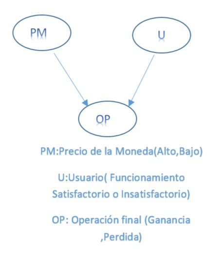

.......................**CryptoSimulator**..............................  

Integrantes:  
Penélope Seijo   
Juan Pablo Madrazo  
Victor Lantigua  

En el proyecto tendremos *Usuarios*, que interactúan con  las *Monedas* (Cryptomoneda) para hacer trading y a la vez interactúan con otros usuarios, en este punto se tiene pensado implementar un algoritmo Minimax para maximimizar las ganancias de un usuario en específico con respecto a los otros usuarios que pueden estar en el sistema.

Otro momento donde tenemos pensado utilizar IA es para calcular dado determinados valores que puede introducir el usuario, las probabilidades de ganancia o pérdida que puede esperar en el proceso según indicadores como un alza o baja del precio de la moneda por ejemplo; para ello utilizaríamos un modelo sencillo de Redes Bayesianas.

 

En la red queremos modelar como el resultado de las operaciones finacieras van a depender del usuario que las lleva a cabo (si sus acciones fueron correctas o no) y de la evolución del precio de la moneda, que está en constante cambio.

**tabla de Distribuciones de Probabilidad**  
| PrecioMoneda(PM) |  Usuario(U) |
|---|---|
| Alza(A)     (0.6)|FuncionamientoSatisfactorio(FS)     0.8|
|Baja(B)      (0.4)|FuncionamientoInsatisfactorio(FI)   0.2|  

**tabla de Distribuciones Condicionales**

|   |A | A | B | B |
Operación Final(OP)|FS | FI | FS | FI|
|---|---|---|---|---|
|Ganancia(G) | 0.95 | 0.4| 0.7 | 0.25| 
Pérdida(P) | 0.95| 0.6| 0.3 |0.75|  

Luego usando los distintos algoritmos de cálculo probabilístico podríamos responder distintas preguntas que surjan debido a la dependencia de estos procesos, por ejemplo sabiendo que se obtuvo una pérdida en que medida fue debido a la actitud del usuario o por la volatividad de la moneda.

